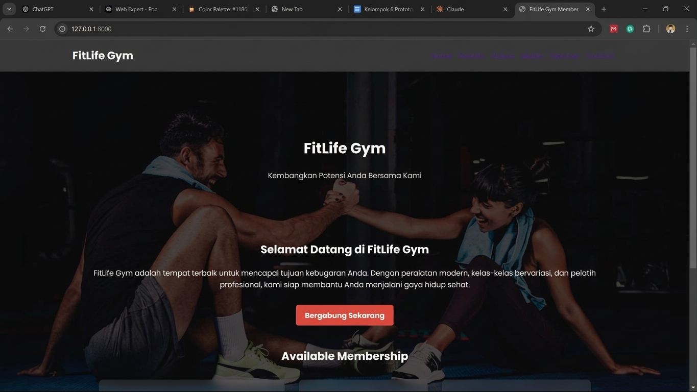
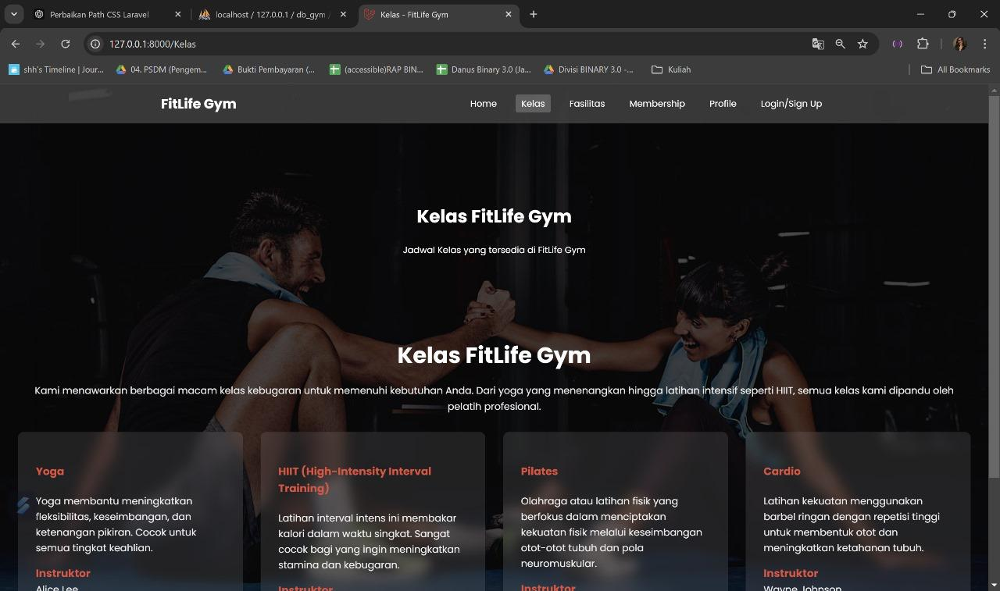
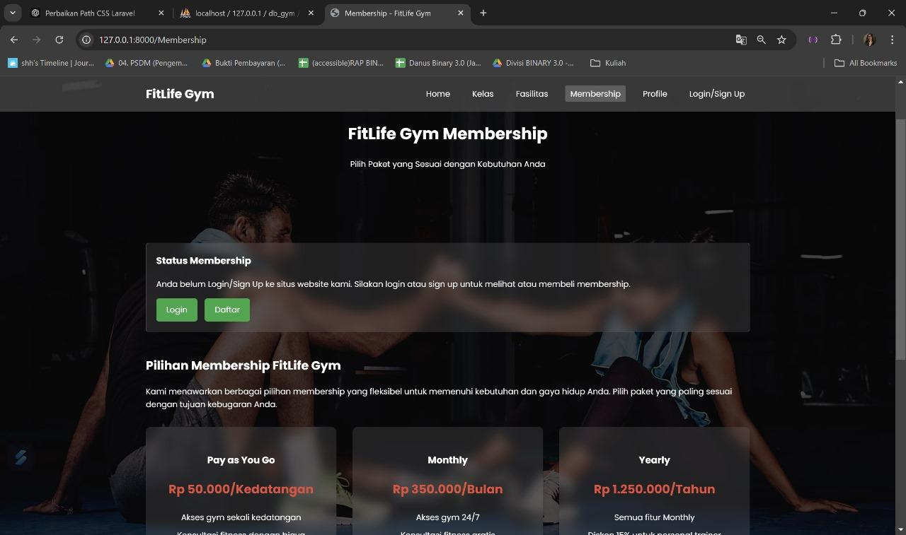
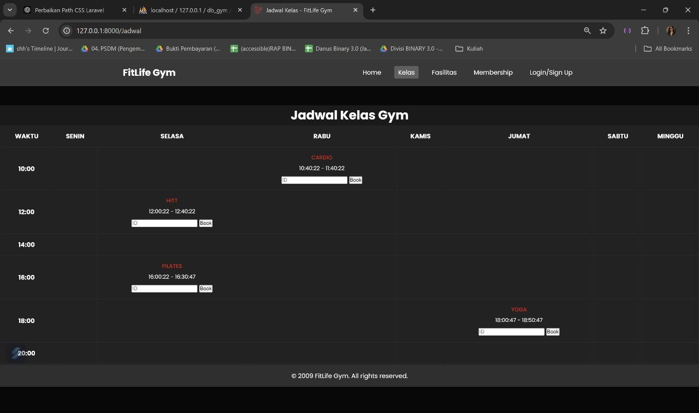
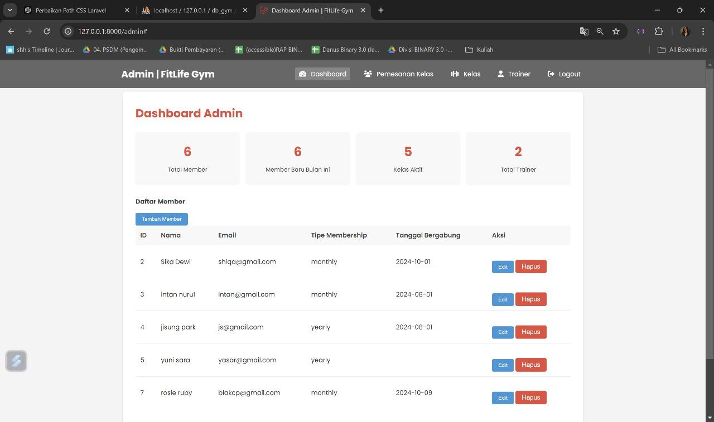
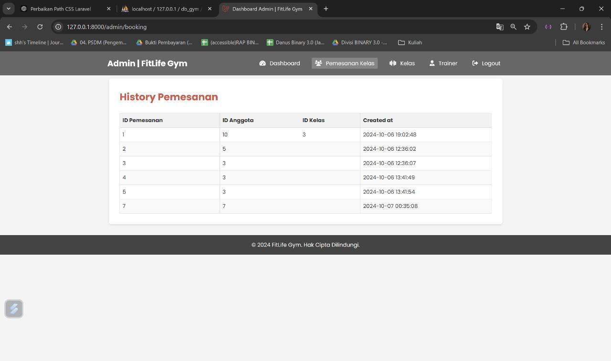
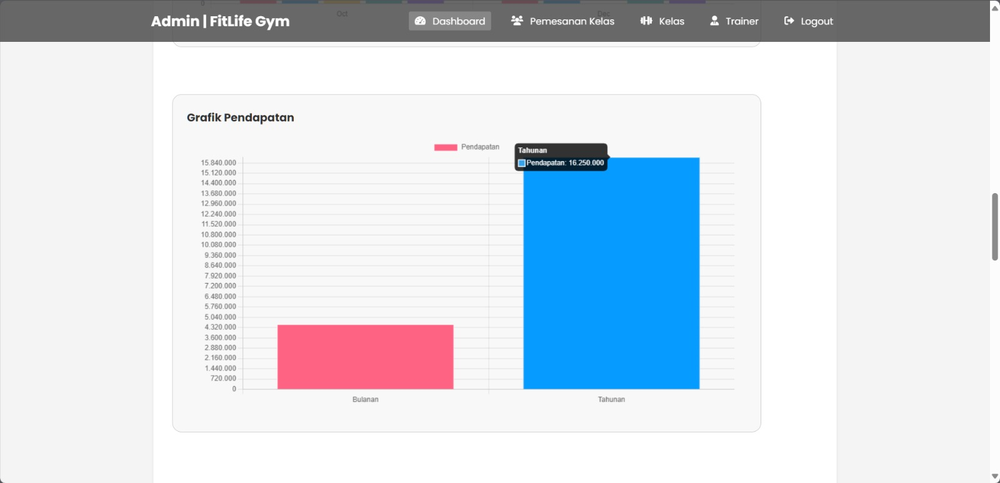

# Gym Membership Website

A web-based gym membership management system developed as a group project for the Database course. The project combines a Laravel web application with a relational database, CRUD functionality, class booking, membership management, and ETL workflows using Pentaho Data Integration.

## Features

- Member registration and membership management
- Gym class listing and scheduling
- Class booking and check-in management
- Trainer information
- Membership and facility information
- User profile management
- Admin dashboard
- CRUD operations for selected master data
- Relational database implementation with MySQL/MariaDB
- ETL workflows using Pentaho Data Integration (Kettle)

## Application Preview

### Homepage

<p align="center">
  
</p>

The homepage introduces the FitLife Gym platform and provides users with
access to gym classes, membership options, facilities, and account features.

### Classes

<p align="center">
  
</p>

Users can explore available fitness classes such as Yoga, HIIT, Pilates,
and Cardio, including class and instructor information.

### Membership

<p align="center">
  
</p>

The membership page presents available membership plans and allows users
to select a plan based on their fitness needs.

### Class Schedule & Booking

<p align="center">
  
</p>

Users can view the gym's class schedule and book available sessions
based on the selected class and time.

### Admin Dashboard

<p align="center">
  
</p>

The admin dashboard summarizes key operational information including
total members, new members, active classes, and trainers. Administrators
can also manage member records directly from the dashboard.

### Booking Management

<p align="center">
  
</p>

Administrators can monitor class booking records and review the relationship
between members and their selected classes.

### Revenue Analytics

<p align="center">
  
</p>

The administrative dashboard also provides revenue visualization to support
monitoring of monthly and annual membership income.

## Tech Stack

- **Backend:** Laravel 11, PHP 8.2+
- **Frontend:** Blade, HTML, CSS, JavaScript, Vite
- **Database:** MySQL / MariaDB
- **ETL:** Pentaho Data Integration (Kettle)
- **Package Management:** Composer, npm

## Repository Structure

```text
gym-membership-website/
├── app/                    # Laravel application logic
├── bootstrap/              # Laravel bootstrap files
├── config/                 # Application configuration
├── database/
│   ├── migrations/        # Database migrations
│   ├── seeders/           # Database seeders
│   └── ...                # Database-related files
├── public/                 # Public assets and entry point
├── resources/              # Blade views and frontend resources
├── routes/                 # Laravel routes
├── storage/                # Application storage
├── tests/                  # Application tests
├── etl/                    # Pentaho Data Integration transformations
├── .env.example            # Example environment configuration
├── artisan                 # Laravel CLI
├── composer.json           # PHP dependencies
├── package.json            # Frontend dependencies
└── vite.config.js          # Vite configuration
```

## Local Setup

### 1. Clone the repository

```bash
git clone https://github.com/YOUR_USERNAME/gym-membership-website.git
cd gym-membership-website
```

### 2. Install PHP dependencies

```bash
composer install
```

### 3. Install frontend dependencies

```bash
npm install
```

### 4. Configure environment

Copy `.env.example` to `.env`:

```bash
cp .env.example .env
```

On Windows PowerShell:

```powershell
Copy-Item .env.example .env
```

Then update the database configuration in `.env`.

### 5. Generate the application key

```bash
php artisan key:generate
```

### 6. Prepare the database

Create a MySQL/MariaDB database and configure its name, username, and password in `.env`.

If the project uses the included migrations:

```bash
php artisan migrate
```

If you need to use the provided SQL dump instead, import the SQL file into your local MySQL/MariaDB database.

### 7. Start the development server

```bash
php artisan serve
```

In another terminal, run the frontend development process:

```bash
npm run dev
```

Then open the local Laravel URL shown by Artisan.

## Database

The project uses a relational database to manage core gym entities such as members, classes, trainers, memberships, bookings, and related transactions.

Database-related files are included in the `database/` directory. SQL/database assets supplied with the original academic project are retained where appropriate for reproducibility.

## ETL

The `etl/` directory contains Pentaho Data Integration (`.ktr`) transformations used for the project's ETL workflow.

Before running the transformations, configure the database connection for your own local environment. Do not commit local usernames, passwords, or other credentials.

## Data Privacy

The sample member names, email addresses, and other records included in the academic database are intended as dummy/sample data for educational purposes.

No real passwords, API keys, or private credentials should be committed to this repository. Local environment values belong in `.env`, which is excluded from version control.

## Academic Project

This project was developed as a group assignment for the Database course.

**Course:** Basis Data  
**Program:** S1 Teknologi Sains Data  
**Institution:** Universitas Airlangga

### Team

- Rashiqa Dewi Nariswari
- Rizal Dwi Prasetyo
- Attala Omar Kareem
- Nabila Mumtaz

## Documentation

The project documentation/report is included in the repository where available.

## Notes

This repository is published as an academic portfolio project. The application may require environment-specific configuration before it can be run locally.
